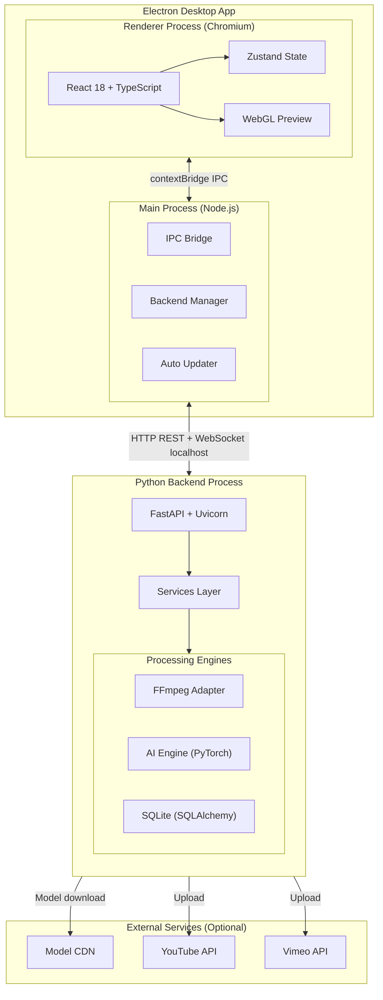
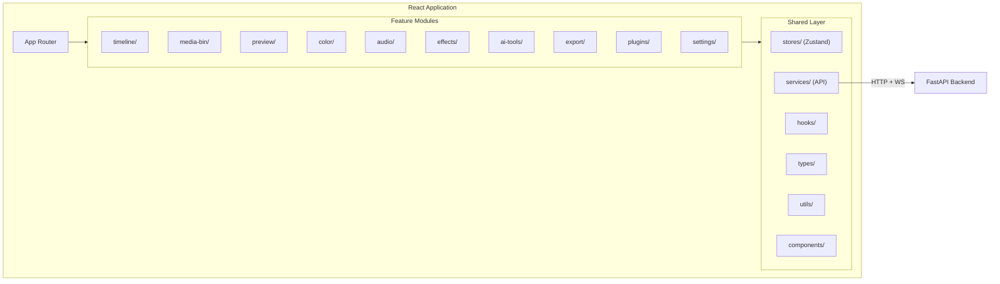
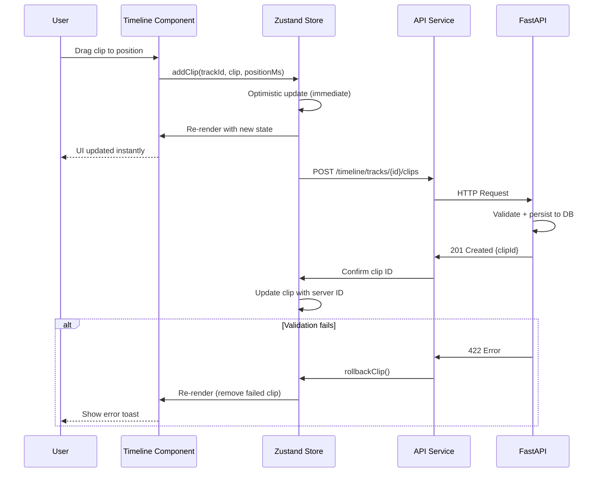
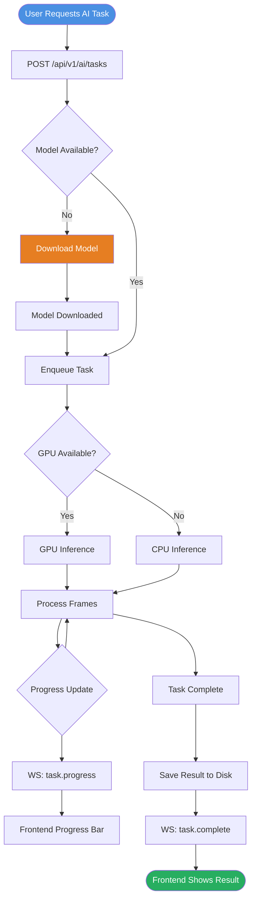
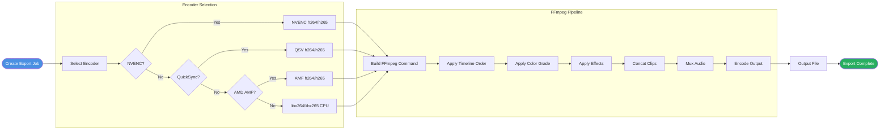
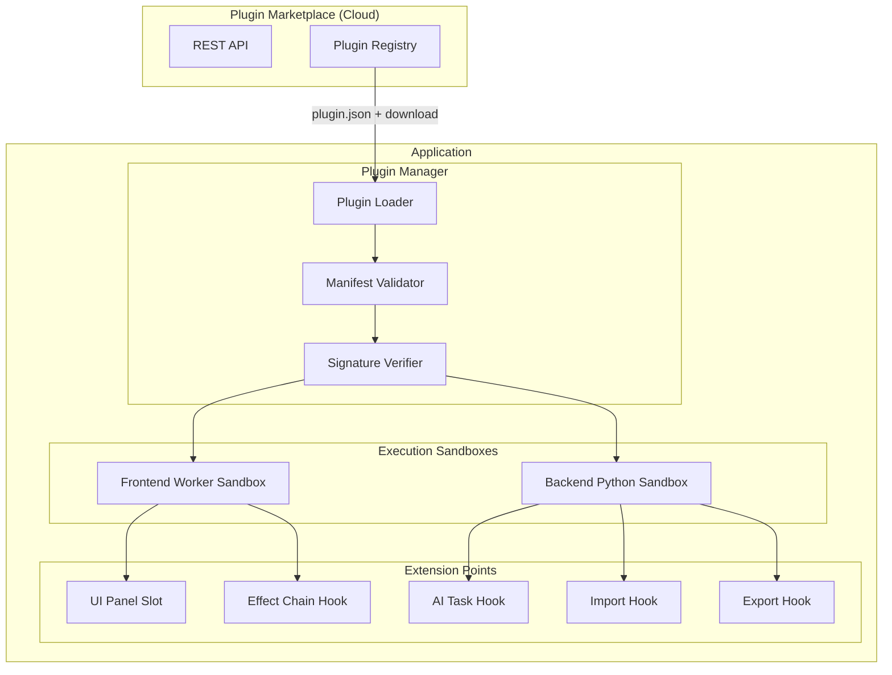
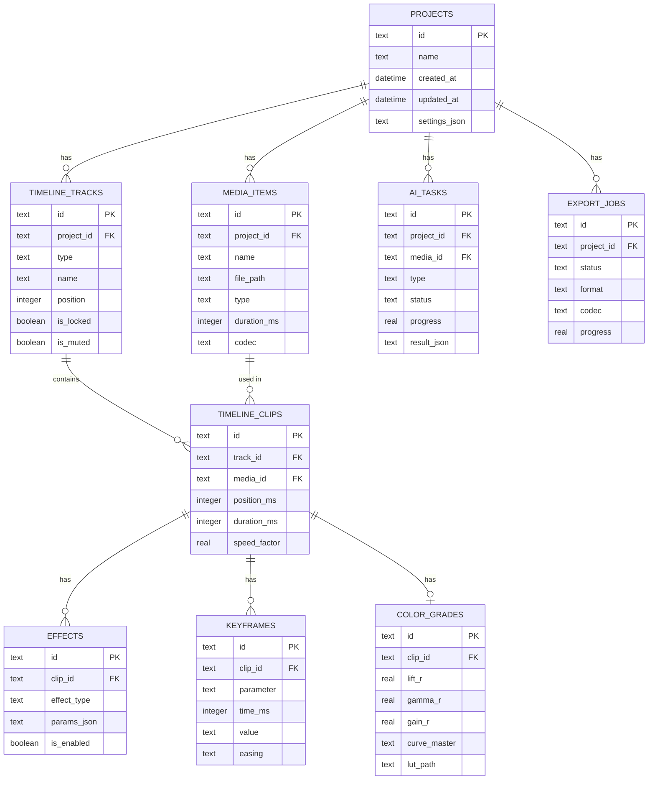
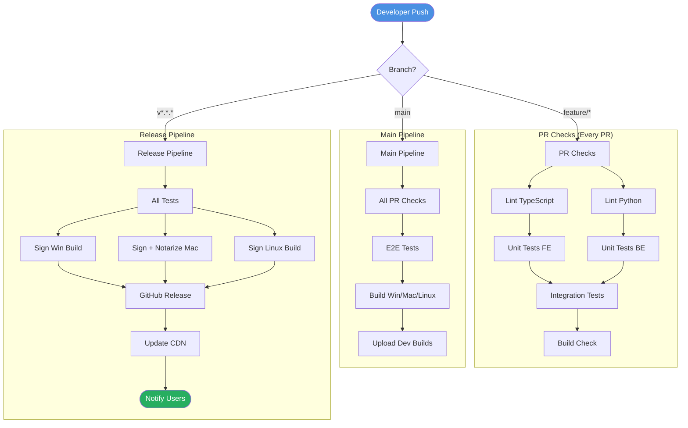
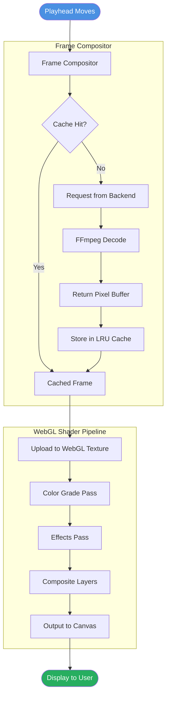

# 17 — Mermaid Diagrams

> **Document:** Mermaid Diagrams v1.0
> **Project:** AI Video Editor
> **Date:** 2026-08-01

---

## 1. System Architecture Overview

---

## 2. Frontend Module Architecture

---

## 3. Timeline Editing Data Flow

---

## 4. AI Task Pipeline

---

## 5. Export Pipeline

---

## 6. Plugin System Architecture

---

## 7. Database Entity Relationship

---

## 8. CI/CD Pipeline Flow

---

## 9. Rendering Engine Flow

