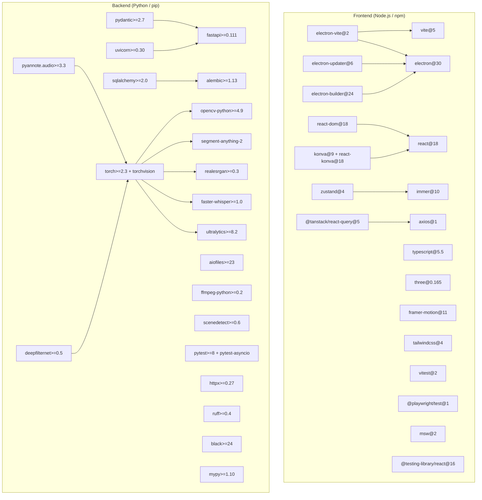
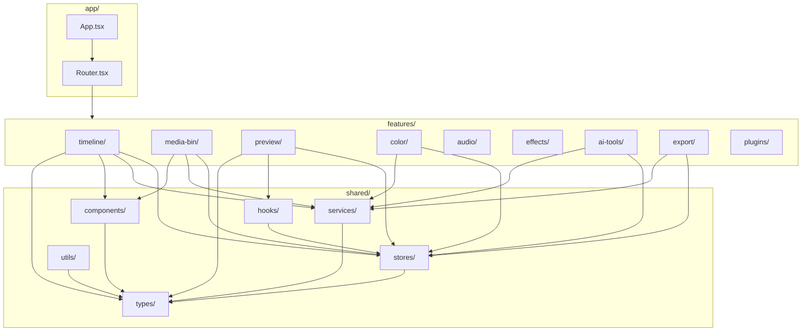
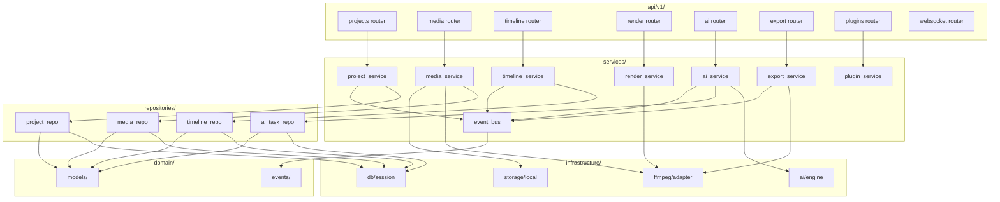

# 18 — Dependency Graph

> **Document:** Dependency Graph v1.0
> **Project:** AI Video Editor
> **Date:** 2026-08-01

---

## 1. Top-Level Package Dependencies



---

## 2. Frontend Internal Module Dependencies



---

## 3. Backend Internal Module Dependencies



---

## 4. Critical Dependency Chain — Video Rendering

```
User seeks to frame 1234
    |
    v
Frontend: PlaybackStore.seek(timeMs)
    |
    v
Preview Component: requests frame
    |
    v
FrameCache: miss
    |
    v
WebSocket: send "decode-frame" request
    |
    v
Backend: WebSocket handler
    |
    v
RenderService.render_frame(timeMs)
    |
    v
TimelineRepo: get_clips_at_time(timeMs)  -> SQLAlchemy -> SQLite
    |
    v
FFmpegAdapter.decode_frame(mediaPath, timeMs)  -> ffmpeg binary -> disk
    |
    v
Buffer returned as bytes
    |
    v
WebSocket: send binary frame
    |
    v
Frontend: receive ArrayBuffer
    |
    v
FrameCache: store frame
    |
    v
WebGL: uploadTexture(buffer)
    |
    v
Shader pipeline: color grade + effects
    |
    v
Canvas: drawFrame()
    |
    v
User sees frame (target: < 100ms)
```

---

## 5. AI Dependency Chain — Transcription

```
User requests transcription
    |
    v
Frontend: POST /api/v1/ai/tasks
    |
    v
Backend: AIRouter -> AIService.submit_task()
    |
    v
AITaskQueue.enqueue(task, priority=8)
    |
    v
AIWorkerPool.dequeue()
    |
    v
ModelRegistry.get("whisper-medium")
    |
    +-- Not loaded: ModelDownloader.ensure_model()
    |       |
    |       v
    |   Download from CDN -> verify SHA256 -> store in ~/.aivideoedit/models/
    |       |
    |       v
    |   WhisperModel.load() -> torch.load() -> CUDA/CPU
    |
    +-- Loaded: return cached model
    |
    v
MediaService.extract_audio(mediaId) -> FFmpegAdapter -> temp.wav
    |
    v
WhisperModel.transcribe(audio_path)
    |
    v
CTranslate2 inference (CPU/CUDA)
    |
    v
Segments with word timestamps
    |
    v
SubtitleExporter.to_srt(segments) -> .srt file
SubtitleExporter.to_json(segments) -> .json metadata
    |
    v
AITaskRepo.save_result(taskId, result)  -> SQLite
    |
    v
EventBus.publish(AITaskCompleted) -> WebSocket broadcast
    |
    v
Frontend: render subtitles on timeline
```

---

## 6. External Dependency Versions Summary

### Frontend Package Versions
| Package | Version | License |
|---------|---------|---------|
| electron | ^30.0.0 | MIT |
| react | ^18.3.0 | MIT |
| typescript | ^5.5.0 | Apache-2.0 |
| vite | ^5.3.0 | MIT |
| zustand | ^4.5.0 | MIT |
| @tanstack/react-query | ^5.50.0 | MIT |
| framer-motion | ^11.2.0 | MIT |
| konva | ^9.3.0 | MIT |
| three | ^0.165.0 | MIT |
| tailwindcss | ^4.0.0 | MIT |
| electron-builder | ^24.13.0 | MIT |

### Backend Package Versions
| Package | Version | License |
|---------|---------|---------|
| fastapi | >=0.111.0 | MIT |
| torch | >=2.3.0 | BSD |
| opencv-python | >=4.9.0 | Apache-2.0 |
| faster-whisper | >=1.0.0 | MIT |
| ultralytics | >=8.2.0 | AGPL-3.0 |
| sqlalchemy | >=2.0.30 | MIT |
| pydantic | >=2.7.0 | MIT |
| alembic | >=1.13.0 | MIT |
| scenedetect | >=0.6.4 | BSD |

> Note: `ultralytics` uses AGPL-3.0. If commercial distribution requires different licensing,
> consider YOLO alternatives or purchasing a commercial license from Ultralytics.
